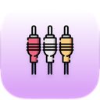

<p align="center">
  
</p>

# Audioscrap

_Audio and Video downloader for YouTube, SoundCloud, and more_


## Features

- Download audio and video from supported sites
- Convert audio to MP3 or FLAC
- Export video as MP4 or MOV
- Select audio bitrate and video resolution
- Embed metadata and thumbnails when available
- Choose save location for downloads
- Integrates with `yt-dlp`, `ffmpeg`, and `deno` for processing
- macOS native UI (SwiftUI)

## Supported links

- YouTube (`youtube.com`, `youtu.be`)
- SoundCloud (`soundcloud.com`)
- Other sites supported by `yt-dlp` (coverage varies by version)

## Audio conversion

- MP3 (select bitrate: `320k`, `256k`, `192k`, `128k`, or `0` for best variable)
- FLAC (lossless)

## Video conversion

- MP4, MOV
- Resolution options: `720p`, `1080p`, `1440p`, `4K`

## Quick start

1. Install prerequisites (recommended):

```bash
brew install yt-dlp ffmpeg deno
```

2. Open the project in Xcode and run the `audioscrap` scheme:

```bash
open audioscrap/audioscrap.xcodeproj
```

3. Paste a supported URL, choose format/quality, and click `Download`.

## Requirements

- macOS and Xcode for building from source
- `yt-dlp` (downloader/format selection)
- `ffmpeg` (merging/encoding/metadata)
- `deno` (required by some `yt-dlp` features)

## Build & Run

Open the Xcode project, clean the build folder, and run the app. The asset catalog includes the AppIcon used above.

## Downloads

Refer to the latest package on the Releases page for the latest macOS (Apple Silicon / ARM64) build:

[Latest macOS (ARM64) build](https://github.com/thomas-boom/audioscrap/releases/latest)

Look for an asset named similar to `audioscrap-macos-arm64.zip`.

## Assets

- App icon used in this README: `audioscrap/Assets.xcassets/AppIcon.appiconset/icon_128x128.png`

## Contributing

Contributions, bug reports, and PRs are welcome. Please open issues on the repository.

## License

Add a `LICENSE` file if you wish to specify licensing for this project.

<p align="center">
  <a href="https://www.flaticon.com/free-icons/wire" title="wire icons">Wire icons created by Freepik - Flaticon</a>
</p>
